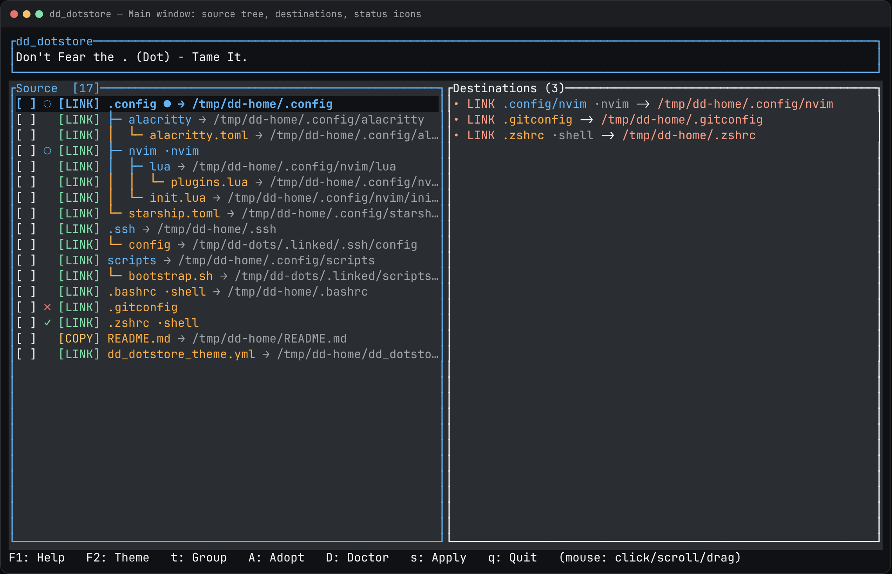

# dd_dotstore

TUI to manage Linux dotfiles: pick a project folder, assign destinations, symlink or copy in bulk, persist the map.



**Illustrated tutorial (install, first run, keys, screenshots):** [ldnddev.github.io/dd_dotstore](https://ldnddev.github.io/dd_dotstore/)

## Install

The installer detects Linux `x86_64` / `aarch64` and installs the musl package from GitHub Releases plus the theme.

The repo is private, so anonymous URLs 404. Use a GitHub token:

```bash
export GITHUB_TOKEN="$(gh auth token)"
curl -fsSL -H "Authorization: Bearer $GITHUB_TOKEN" \
  https://raw.githubusercontent.com/ldnddev/dd_dotstore/master/install.sh | bash

dd_dotstore --help
```

From a source checkout: `./install.sh`. Uninstall: `./install.sh --uninstall`. Full options, PATH notes, and the public-repo curl form are in the [tutorial](https://ldnddev.github.io/dd_dotstore/#install).

## Run

```bash
cargo run
cargo run -- --root /path/to/dotfiles
cargo run -- --help
cargo test
```

Requires Rust 1.85+ (edition 2024) and a Unix-like OS (symlinks). Config is `.dd_dotstore.json` in the project root.

## What you get

- Tree of the project, multi-select, LINK or COPY per item
- Smart dest defaults (XDG / `$HOME` / `.linked` fallback)
- Plan dialog, overwrite warnings, undo (last 10)
- Groups, reverse-import (`A`), doctor (`D`)
- Theme editor (`F2`), ignore editor, import/export
- Keyboard and mouse; help is `F1`

Visual contract: [`LDNDDEV_TUI_VISUAL_STANDARD.md`](LDNDDEV_TUI_VISUAL_STANDARD.md).

## License

MIT
